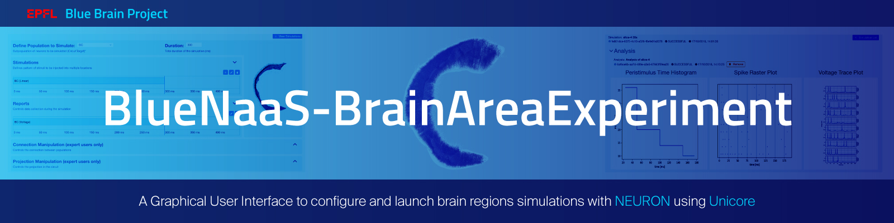
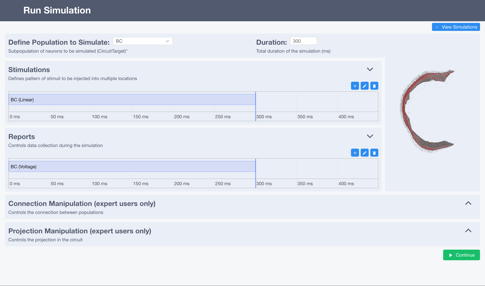

# BlueNaaS-BrainAreaExperiment


A Graphical User Interface to configure and launch brain region simulations with [NEURON](https://www.neuron.yale.edu/neuron/) using [Unicore](https://www.unicore.eu/).

### Usage


This application is deployed at:
- [EBRAINS](https://simulation-launcher-bsp-epfl.apps.hbp.eu/index.html#/circuits/hippo_hbp_sa_full_ca1) as part of the [Ebrains Wizard](https://bluebrain.github.io/bsp-usecase-wizard/dev/index.html).
- [BBP](https://portal.bluebrain.epfl.ch/) as part of the "Simulating a hippocampus microcircuit" [MOOC](https://www.edx.org/course/simulating-a-hippocampus-microcircuit).


### Installation
``` npm install ```

### Run as dev
``` npm run dev ```

### Deploy to Ebrains OpenShift
* Go to OpenShift https://okd.hbp.eu/console/project/bsp-epfl/browse/deployments
* On the top-right corner under profile, click on "Copy Login Command" and paste it on the terminal
* Build the image `docker build -t docker-registry.ebrains.eu/bsp-epfl/sim-launcher:ebrains .`
* Login to Ebrains image registry:
  * Go to [registry](https://docker-registry.ebrains.eu/harbor/projects/2/repositories/sim-launcher)
  * Click on the user profile and get the `Username` and the `CLI secret`
  * Type `docker login docker-registry.ebrains.eu`
* Push image `docker push docker-registry.ebrains.eu/bsp-epfl/sim-launcher:ebrains`

### MOOC BBP specific info
For this MOOC in BBP infrastructure, we have a specific branch `mooc-bbp` because this app is different from the original one.
Some of the changes are:
- Use VMM - LTI authentication
- Show token expiration page when VMM fails
- Dedicated plan to deploy in Openshift (https://bbpgitlab.epfl.ch/nse/simulation-launcher-ui/-/jobs/29876)
- Dedicated deployment (https://ocp.bbp.epfl.ch:8443/console/project/bbp-ou-nse/browse/dc/mooc-sim-launcher?tab=history)

### Generate the documentation
``` npm run jsdoc ```

### Documentation Online

[EBRAINS Cellular Level Simulation documentation](https://github.com/ebrains-cls-interactive/docs/blob/main/source/online_usecases/brain_area_circuit_in_silico_experiments/hippocampus/configure_run_brainregion_preconf_model_data/configure_run_brainregion_preconf_model_data.rst).

### Simulation configuration documentation
[Blue Config documentation](https://sonata-extension.readthedocs.io/en/latest/blueconfig.html).

## Funding & Acknowledgment (MOOC)
- This project/research was supported by funding to the Blue Brain Project, a research center of the École polytechnique fédérale de Lausanne (EPFL), from the Swiss government’s ETH Board of the Swiss Federal Institutes of Technology.
- This project/research has received funding from the European Union’s Horizon 2020 Framework Programme for Research and Innovation under the Specific Grant Agreement No. 945539 (Human Brain Project SGA3).

Copyright (c) 2021-2022 Blue Brain Project/EPFL


## Funding & Acknowledgment (EBrains)
- This project/research was supported by funding to the Blue Brain Project, a research center of the École polytechnique fédérale de Lausanne (EPFL), from the Swiss government’s ETH Board of the Swiss Federal Institutes of Technology.
- This research was supported by the HBP Brain Simulation Platform, funded from the European Union’s Horizon 2020 Framework Programme for Research and Innovation under the Specific Grant Agreement No. 720270 (Human Brain Project SGA1).
- This research was supported by the HBP Brain Simulation Platform, funded from the European Union’s Horizon 2020 Framework Programme for Research and Innovation under the Specific Grant Agreement No. 785907 (Human Brain Project SGA2).

Copyright (c) 2017 - 2023 Blue Brain Project/EPFL
